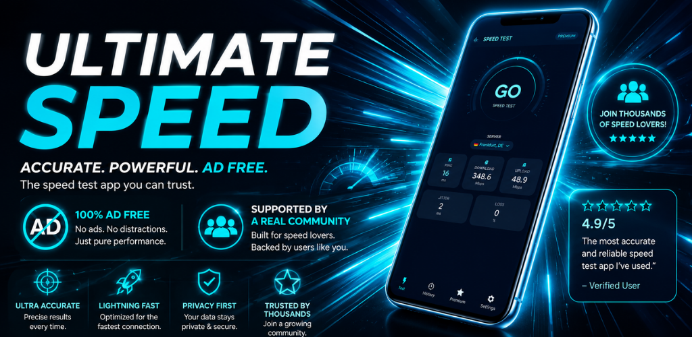
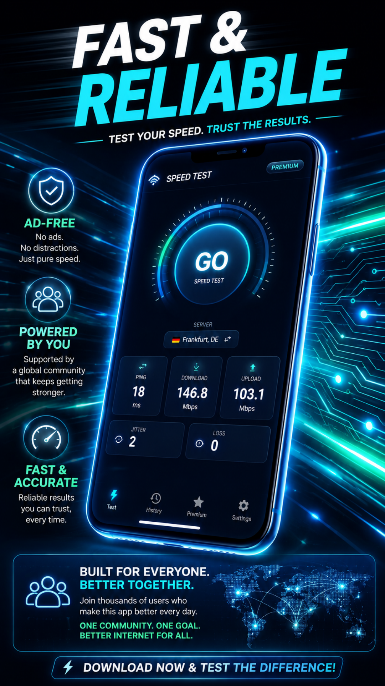
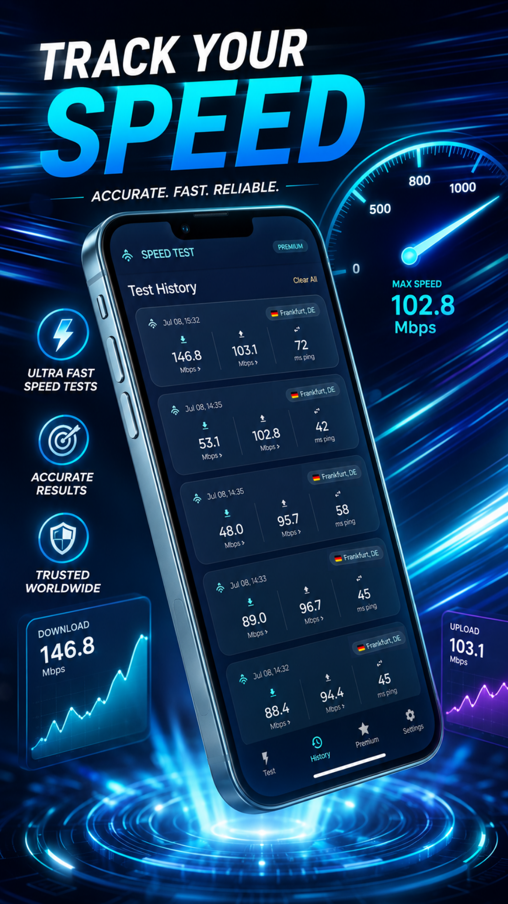
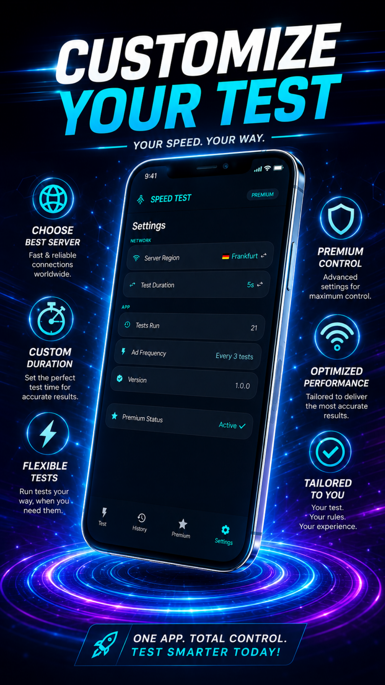
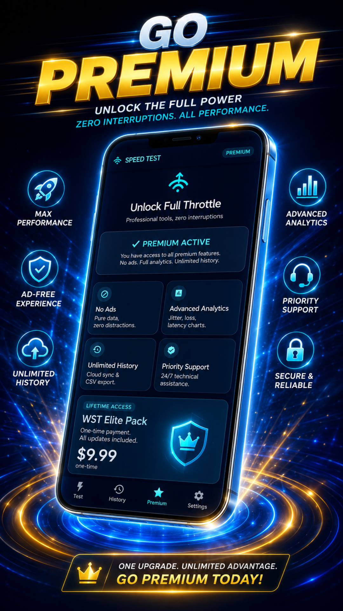

# 🚀 WST — WiFi Speed Test Ad-Free

### Private, ad-free WiFi and internet performance diagnostics.

## Screenshots

---

## About

WST measures download speed, upload speed, ping, jitter, packet loss and loaded latency. Test history is stored locally, and optional Premium features add advanced metrics, charts, extended history and CSV export.

## Features

- Download and upload speed measurement
- Ping, jitter and packet-loss estimates
- Loaded-latency sampling and charts
- Multiple global diagnostic endpoints
- Local test history
- Premium extended history and CSV export
- Supporter badges and eligible launcher icons
- No third-party ads or advertising identifiers

## Optional Purchases

| Product | Type | Main benefit |
|---|---|---|
| Supporter One-Time | One-time | Removes support prompts and unlocks a Supporter badge. |
| Monthly Supporter | Subscription | Removes prompts and provides a Supporter badge and eligible custom app icons while active. |
| Premium Lifetime | One-time | Advanced metrics, loaded-latency charts, packet-loss insights, extended history, CSV export, no support prompts and eligible icons. |

Prices, currencies, trial eligibility and current benefits are shown by Google Play before purchase. Subscriptions renew until cancelled through Google Play.

## Privacy

- No third-party advertising SDKs
- No behavioral advertising or advertising profiling
- No app account required for core use
- App content stays local whenever possible
- Google Play and RevenueCat process only the purchase information needed for optional products

Read the complete [Privacy Policy](./PRIVACY_POLICY.md).

## Download

**Google Play:** [https://play.google.com/store/apps/details?id=com.wst.wifispeedtest](https://play.google.com/store/apps/details?id=com.wst.wifispeedtest)

## Documentation

| Document | Purpose |
|---|---|
| [Privacy Policy](./PRIVACY_POLICY.md) | Information handling and user rights |
| [Terms of Use](./TERMS_OF_SERVICE.md) | Rules, billing and app-specific limitations |
| [License](./LICENSE) | Proprietary software licence |
| [Security Policy](./SECURITY.md) | Responsible vulnerability reporting |
| [Support](./SUPPORT.md) | Help and troubleshooting |
| [Changelog](./CHANGELOG.md) | Notable app changes |
| [Contributing](./CONTRIBUTING.md) | Bug reports and feature suggestions |

## Developer

**Denis Casian** — Independent developer, Romania

- Website: [deniscasian.com](https://deniscasian.com/)
- Support: [support@deniscasian.com](mailto:support@deniscasian.com)
- Bug reports: [bugs.deniscasian.com](https://bugs.deniscasian.com/)

---

[WST on Google Play](https://play.google.com/store/apps/details?id=com.wst.wifispeedtest) · [Privacy](./PRIVACY_POLICY.md) · [Terms](./TERMS_OF_SERVICE.md)

*© 2026 WST. All rights reserved.*

