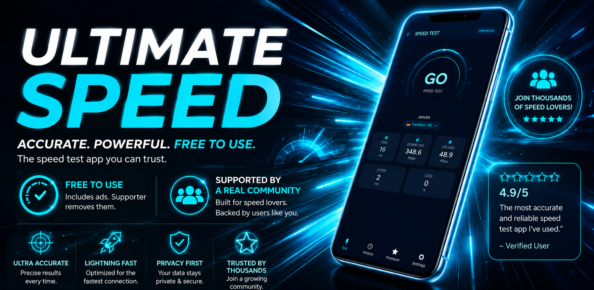
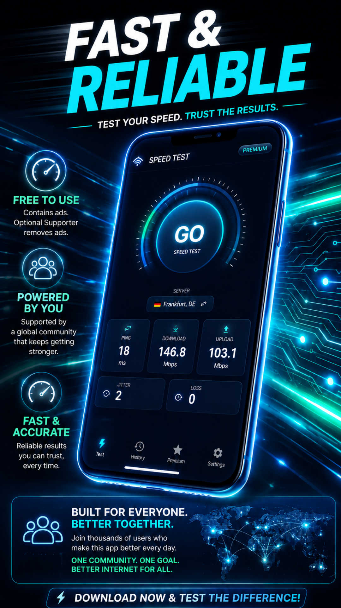
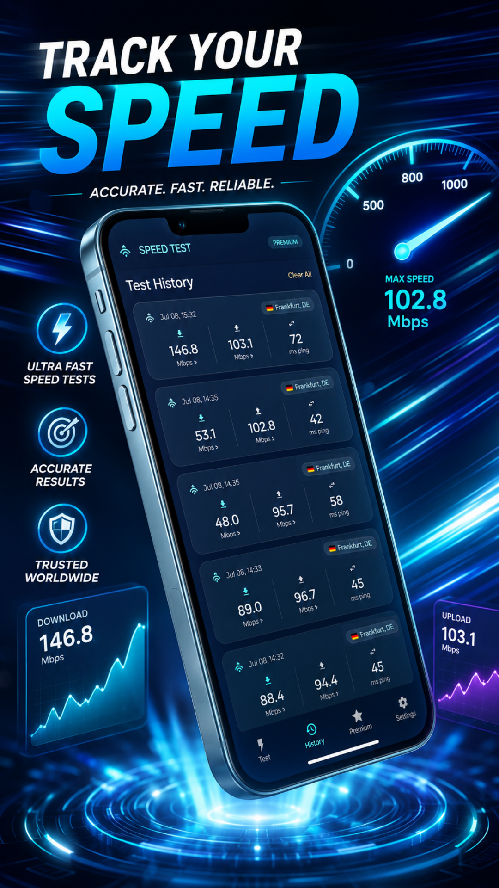
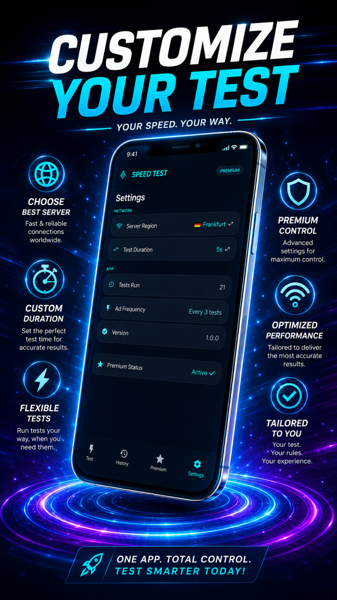
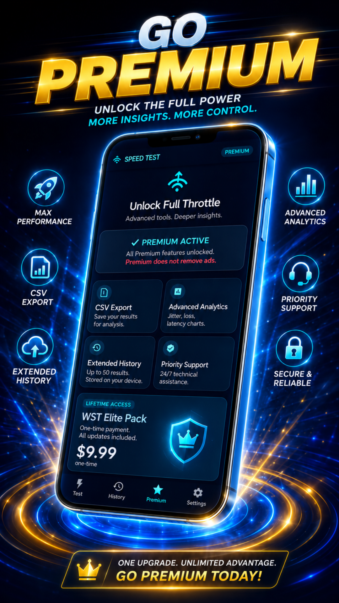
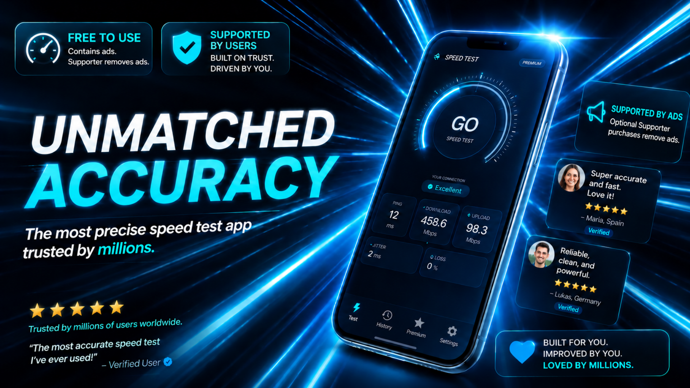
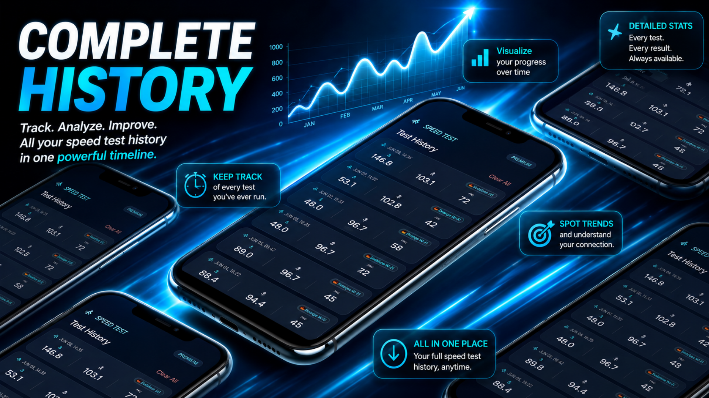
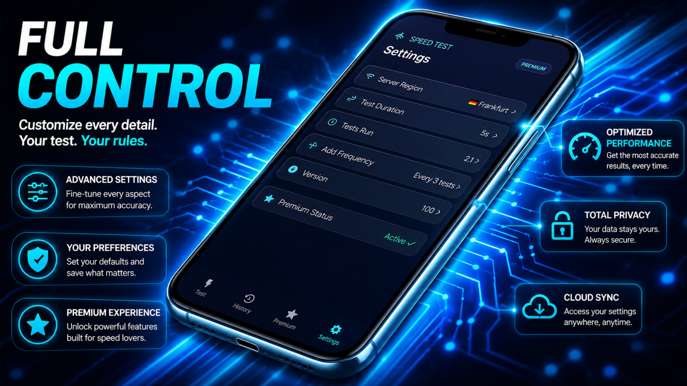
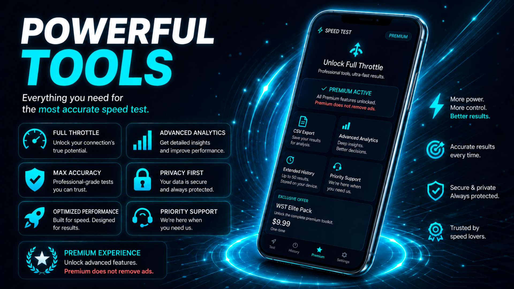

# 📶 WST WiFi Speed Test

### Download, Upload, Ping & Connection Diagnostics

**A focused internet speed tester for Android.**  
Clean. Fast. Free with optional ad-free Supporter tiers.

---

Tablet screenshots

 

---

## 📶 About WST

**WST WiFi Speed Test** measures internet connection performance on Android.
Compare Wi-Fi rooms, routers and mobile data using download, upload and
HTTP latency measurements, with deeper diagnostics available through Premium Lifetime.

> ### 🔔 Free App — Supported by Advertising
> WST is free and funded by **Google AdMob** advertising: adaptive banners,
> native ads, interstitials and app-open ads.  
> **Supporter One-Time** removes ads while the purchase entitlement is valid.  
> **Monthly Supporter** removes ads while the subscription is active.  
> **Premium Lifetime unlocks features — it does not remove ads.**

---

## ✨ Features

### 🚀 Real Connection Measurements

- ⬇️ Download speed in Mbps
- ⬆️ Upload speed in Mbps
- ⏱️ HTTP ping / response latency
- 📈 Real-time speed gauges and test results
- 📱 Wi-Fi and mobile-data connection testing

### 🌍 Automatic Server Selection

- Auto checks latency and small download/upload requests before choosing an endpoint
- Independent public LibreSpeed endpoints and Cloudflare CDN
- Alternative servers after failures or rate limits, when available
- Manual server selection for comparisons
- HTTP 429 cooldowns are respected to avoid repeated requests to a rate-limited host

### 📊 Deeper Diagnostics

- **Jitter:** variation between initial HTTP latency samples
- **Loaded-latency chart:** real HTTP response times during download and upload
- **Ping loss:** unanswered replies in a 20-probe ICMP sample to 1.1.1.1
- Unsupported, blocked or incomplete ICMP sampling is **unavailable**, not confirmed 100% loss
- Explanations of what the metrics mean

> Results are estimates, not guaranteed line capacity. Device performance,
> Wi-Fi conditions, congestion, routing and server availability affect measurements.
> Speed tests transfer data and may use a metered connection allowance.

### 🗂️ Local History

- Latest **10 results** stored on your device
- Up to **50 results** with Premium Lifetime
- **CSV export** with Premium Lifetime
- No developer-operated server stores your personal test history

---

## 👑 Premium Features

| Feature | Free | Premium Lifetime |
|---|:---:|:---:|
| Download, upload and HTTP ping | ✅ | ✅ |
| Automatic / manual server selection | ✅ | ✅ |
| Local history | 10 results | 50 results |
| **Advanced jitter diagnostics** | ❌ | ✅ |
| **ICMP ping-loss insight** | ❌ | ✅ |
| **Loaded-latency chart** | ❌ | ✅ |
| **CSV history export** | ❌ | ✅ |
| **Premium badge and eligible app icons** | ❌ | ✅ |
| Advertising | Included | **Still included** |

> ❤️ Ad removal is separate: purchase **Supporter One-Time** or **Monthly Supporter**.

---

## 💳 Pricing

WST is **free** and supported by Google AdMob advertising. All purchases are optional.
Current prices and any applicable offers are displayed in the app and Google Play
in your local currency.

### One-Time Purchases

| Product | Price | Benefits |
|---|:---:|---|
| 💎 **Premium Lifetime** | See Google Play | 📊 Advanced metrics and chart 🗂️ 50-result history 📄 CSV export 🏅 Premium badge and eligible icons ⚠️ **Still includes ads** |
| ❤️ **Supporter One-Time** | See Google Play | 🚫 Removes all ads while entitlement is valid 🏅 Supporter badge ❤️ Supports development; does not unlock Premium tools |

### Subscriptions

| Product | Price | Benefits |
|---|:---:|---|
| ❤️ **Monthly Supporter** | See Google Play | 🚫 Removes all ads while active 🏅 Supporter badge 🎨 Supporter app icons ❤️ Recurring support; does not unlock Premium tools |

> Refunded or revoked Supporter purchases, or expired Monthly Supporter access,
> may restore ads after purchase status synchronises. Premium Lifetime does not
> cancel a Monthly Supporter subscription or imply ownership of Supporter products.

---

## 🛡️ Privacy

| | |
|---|---|
| 🔔 | Google AdMob advertising when ads are enabled |
| ✅ | UMP privacy choices; requests only when consent status permits them |
| ❤️ | No Mobile Ads initialisation when a valid ad-removal entitlement is known at startup |
| 🗂️ | Test history and preferences stored locally |
| 🌐 | Diagnostic endpoints receive normal connection metadata, including IP address |
| 🛒 | Purchases managed by Google Play and RevenueCat |
| ⚙️ | Available advertising privacy choices can be reviewed in Settings while ads are enabled |

Google advertising services may process identifiers, approximate location,
ad interactions and diagnostics. Removing ads does not automatically erase
information already held by providers.

→ **[Full Privacy Policy](./PRIVACY_POLICY.md)**

---

## 🔗 Download

**[WST on Google Play](https://play.google.com/store/apps/details?id=com.wst.wifispeedtest)**  
Android 7.0 or later.

---

## 🌐 Diagnostic Services

WST uses public diagnostic endpoints, including **Cloudflare** and
**LibreSpeed** servers operated by Clouvider, Turris, GARR and CESNET.
Legacy endpoints from Tele2, Bouygues and Online.net remain manually selectable.
ICMP loss probes use **1.1.1.1** and are separate from the HTTP speed-test server.

WST is an independent app, not affiliated with or endorsed by these providers.
Public endpoints can be unavailable or rate-limited; no uptime or measurement guarantee is made.

---

## 📄 Legal Documents

| Document | Description |
|---|---|
| [Privacy Policy](./PRIVACY_POLICY.md) | Data, advertising and privacy choices |
| [Terms of Use](./TERMS_OF_SERVICE.md) | Rules for using WST |
| [License](./LICENSE) | Proprietary software license |
| [Security Policy](./SECURITY.md) | Reporting vulnerabilities |
| [Changelog](./CHANGELOG.md) | Current development changes |
| [Support](./SUPPORT.md) | Help and contact information |

---

## 👤 Developer

**Denis Casian** — Independent developer, Romania 🇷🇴

| | |
|---|---|
| 🌐 Website | [deniscasian.com](https://deniscasian.com) |
| 📧 Support | [support@rdcapps.com](mailto:support@rdcapps.com) |
| 🐛 Bug Reports | [bugs.rdcapps.com](https://bugs.rdcapps.com) |
| 📱 App | [WST on Google Play](https://play.google.com/store/apps/details?id=com.wst.wifispeedtest) |

---

Made with ❤️ for better connection insights.

**[Download WST](https://play.google.com/store/apps/details?id=com.wst.wifispeedtest)** ·
**[Privacy Policy](./PRIVACY_POLICY.md)** ·
**[Terms of Use](./TERMS_OF_SERVICE.md)**

*© 2026 Denis Casian. All rights reserved.*

